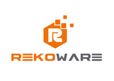

## ShieldsGate Signage Application



This application was built by Reko ware to serve as a one stop solution for managing signage for Shields Gate :blush:

Take a look at the [Settings page](https://github.com/ionic-team/ionic-starter-super/blob/master/src/pages/settings/settings.html#L38) for a cool example of a page navigating to itself to provide a different UI without duplicating code.


## Useful links

#### [Coding Standards](https://github.com/Microsoft/TypeScript/wiki/Coding-guidelines) | [Rekoware](http://www.rekoware.com/)

## Table of Contents

1. [Getting Started](#getting-started)
2. [Pages](#pages)
3. [Providers](#providers)
4. [i18n](#i18n) (adding languages)

## <a name="getting-started"></a>Getting Started

To test this app out , install the latest version of the [Ionic CLI] (https://ionicframework.com/docs/cli/#installation) and run:

```bash
ionic serve alligatorhead
```

## Branches

* `master` - Should always contain tested releasable code, this branch is intended for production.

* `dev` - Should contain stable tested code, but these tests would exclude e2e tests.

* `featurex` - This is a template for each feature which will be added, see [Git Workflow](#git-workflow)


## <a name="git-workflow"></a>Git Workflow 

```

                     +----------------+
              +------> featurebranch-1 +-----------+ (pull request)
              |      +----------------+            |
              |                                    |
  +--------+  |                                    +---------+      +--------+
  | dev  + -                                       |  dev    |  --- | master |
  +----+---+  |                                    +---------+      +--------+
              |                                    |
              |      +-----------------+           |            
              +------> featurebranch-2 +-----------+  (pull request)
                    +------------------+
```

`Master` branch is protected and direct pushes are not allowed.

When working on a new feature:

1. Create a new branch that branches off the `master` branch. 
2. Complete the feature/work and submit a pull request to be merged into `master`.
3. Each feature branch name should have the `page` the feature is related to, the `id` of the task
or a short `description` of the feature or work to be carried out 

Examples of descriptions: `selectors`, `create-login`, `create-logout`.

**Examples of feature branch names:** 

E.g `login`-`15`-`selectors` or `dashboard`-`13`-`create-login`

## Pull Request  

When submitting a pull request ensure the following:

1. Ensure there are no merge conflicts
2. Ensure all tests are passing or failing correctly.
3. Ensure a description of the work done is provided
4. Select `close branch when merged` . 

After the reviewer has reviewed the pull - request, the reviewer should merge the pull request into the `dev` branch. Then **all tests** should be executed to ensure all tests are either passing or failing correctly. 

** Note: ** If tests are failing incorrectly. The reviewer should immediately fix all broken tests.


## Providers

The Super Starter comes with some basic implementations of common providers.

### User

The `User` provider is used to authenticate users through its `login(accountInfo)` and `signup(accountInfo)` methods, which perform `POST` requests to an API endpoint that you will need to configure.

### Api

The `Api` provider is a simple CRUD frontend to an API. Simply put the root of your API url in the Api class and call get/post/put/patch/delete 

## i18n

Ionic Super Starter comes with internationalization (i18n) out of the box with [ngx-translate](https://github.com/ngx-translate/core). This makes it easy to change the text used in the app by modifying only one file. 

### Adding Languages

To add new languages, add new files to the `src/assets/i18n` directory, following the pattern of LANGCODE.json where LANGCODE is the language/locale code (ex: en/gb/de/es/etc.).

### Changing the Language

To change the language of the app, edit `src/app/app.component.ts` and modify `translate.use('en')` to use the LANGCODE from `src/assets/i18n/`
